# Dancepad

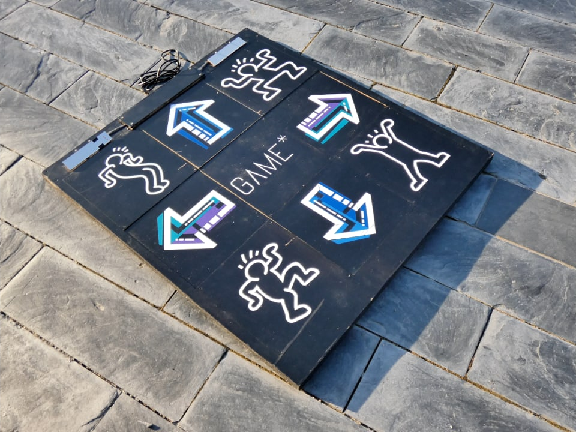

Wooden dance mats to play anything.

## Usage

### Move or Die

The game can be found [here](https://moveordiegame.com/).

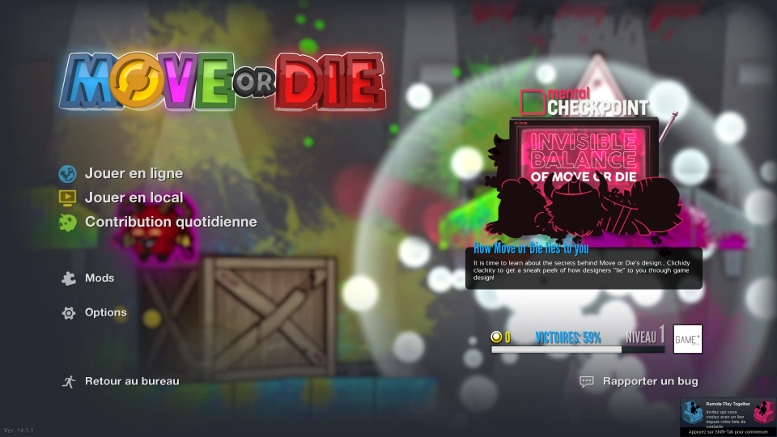

#### Setup

> :information_source: **Note!** This setup requires an operator to handle the menu.

Plug the two dancepads, then, for each dancepad:

1) Select "Options".

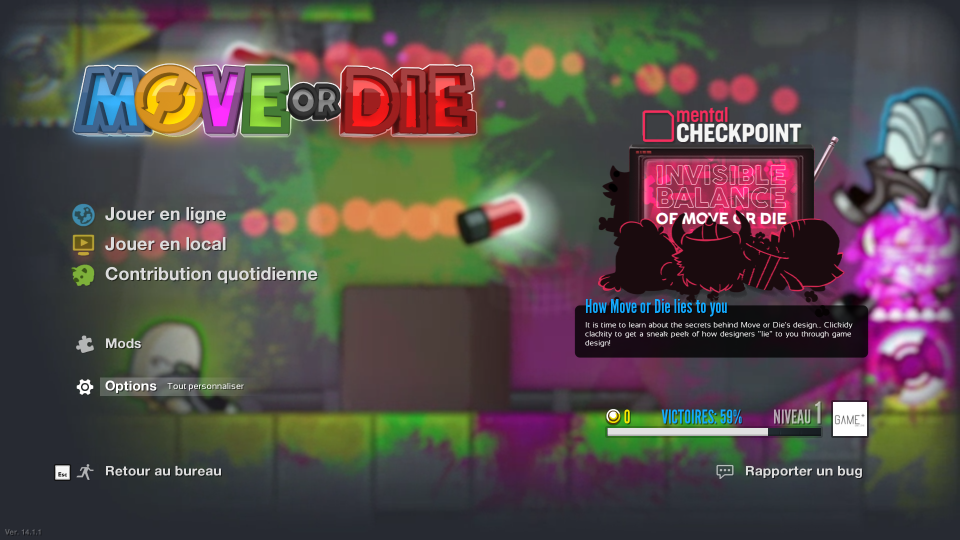

2) Select "General".

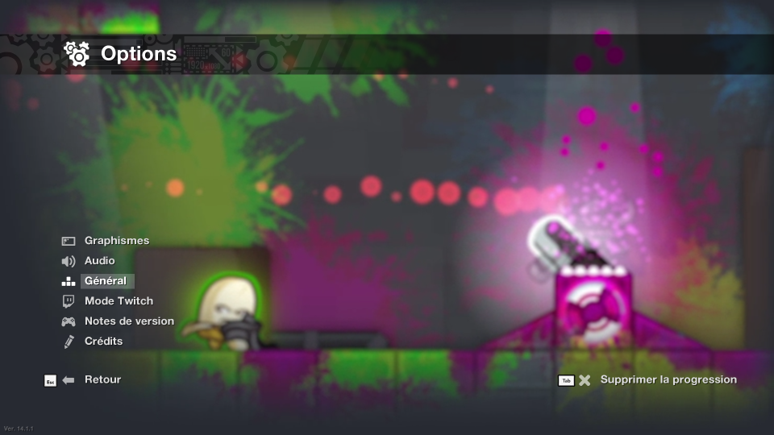

3) Select "Key configuration".

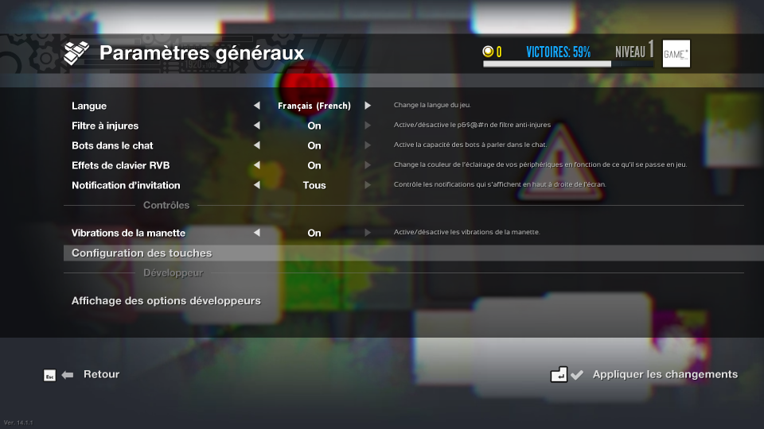

4) Select "Letters".

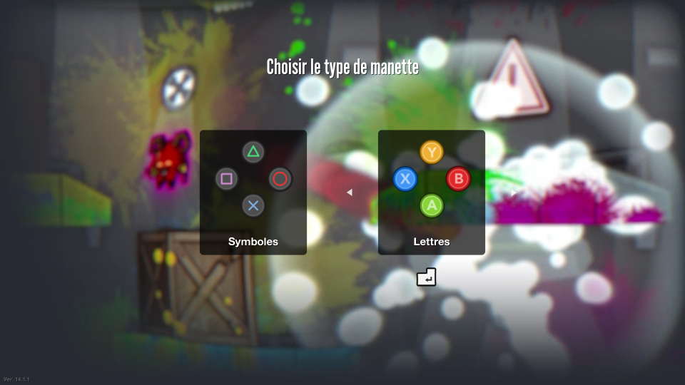

5) For the "A" button, use the Up arrow on the dancepad.

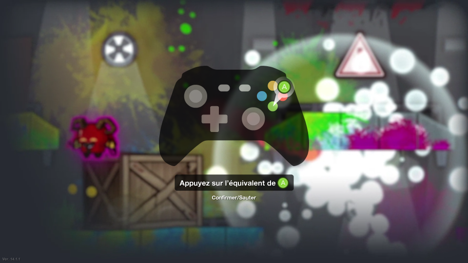

5) For the "B" button, use the Special left button on the dancepad.

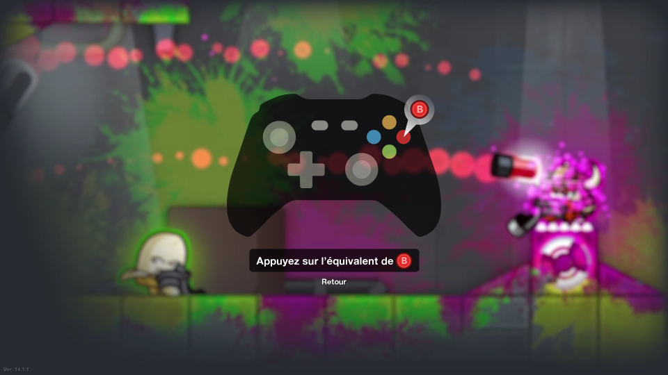

5) For the "Up" button, use the Special right button on the dancepad.

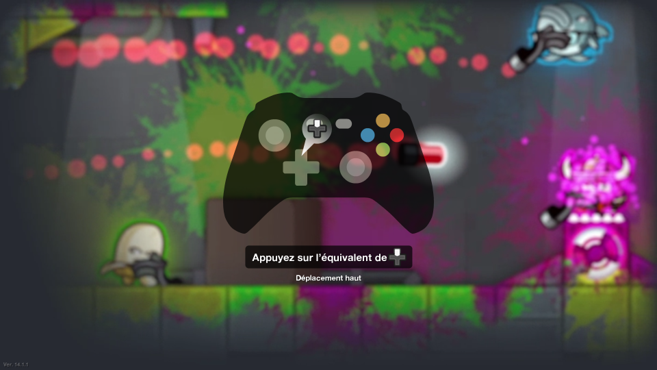

5) For the rest of the directions, use the corresponding arrows on the dancepad (Down, then Left, then Right).

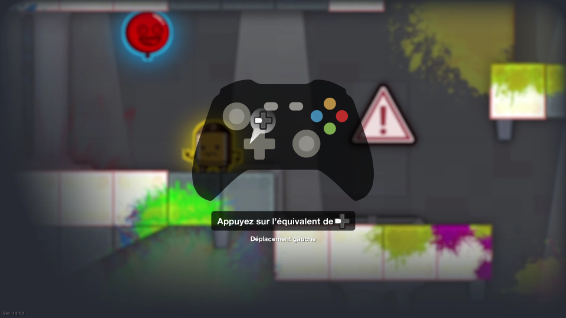
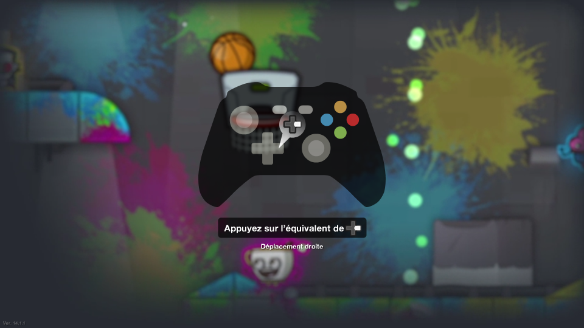

6) Finally, for every remaining input, use the "B"/Special left button on the dancepad.

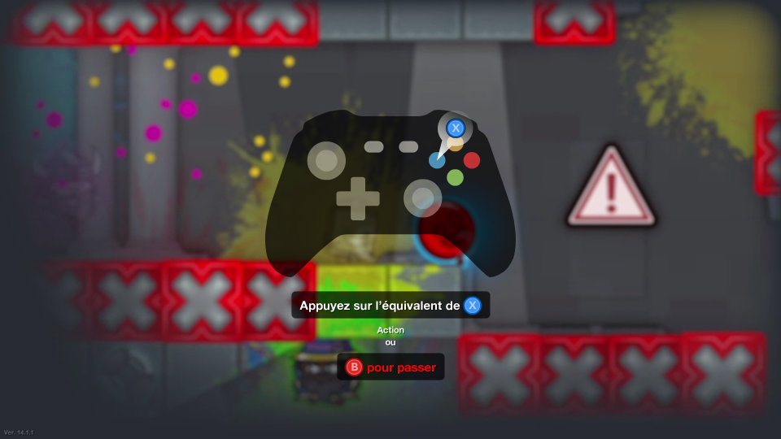

#### Gameplay

> :information_source: **Note!** Once the setup done, the players can use the menu by themselves. It is best, however, to have an operator to help.

1) Select "Local play".

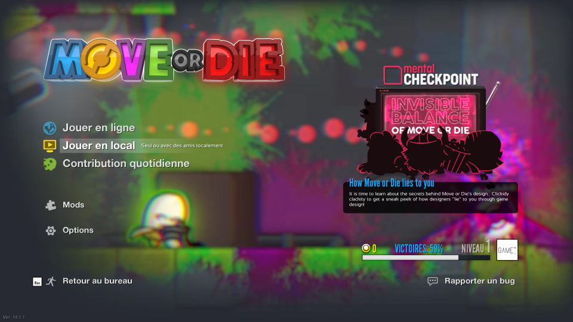

2) Select "Shared screen".

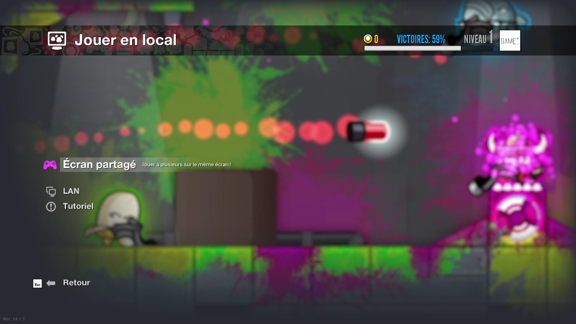

3) Choose a duration.

> :information_source: **Note!** Roughly, the length of the game corresponds to the number of stages. Remember that the players are using dancepads, so we recommand no more than 5 minutes.

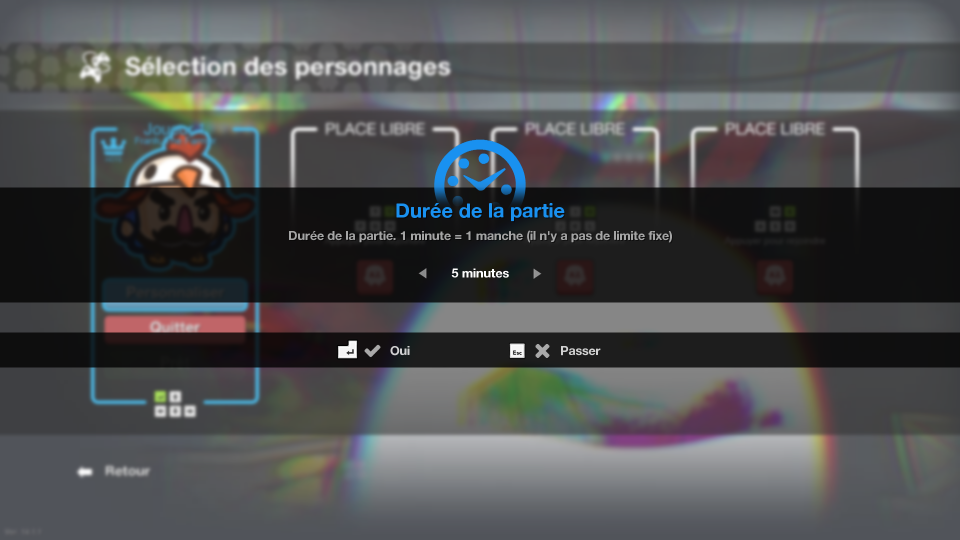

4) Select "No" when asked about Mutators.

> :warning: **Warning!** You may want to try using Mutators, but it's _really_ difficult when using a dancepad...

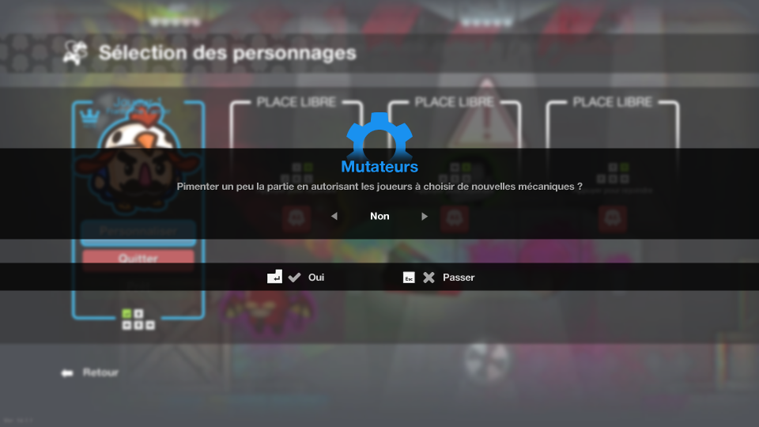

5) On the character selection, if a character is already present, dismiss it using a keyboard and selecting the "Quit" button. Then, on each dancepad, press once any arrow, then twice the Down arrow, then once the Up arrow.

> :information_source: **Note!** If people are feeling like it, you can of course customise each character!

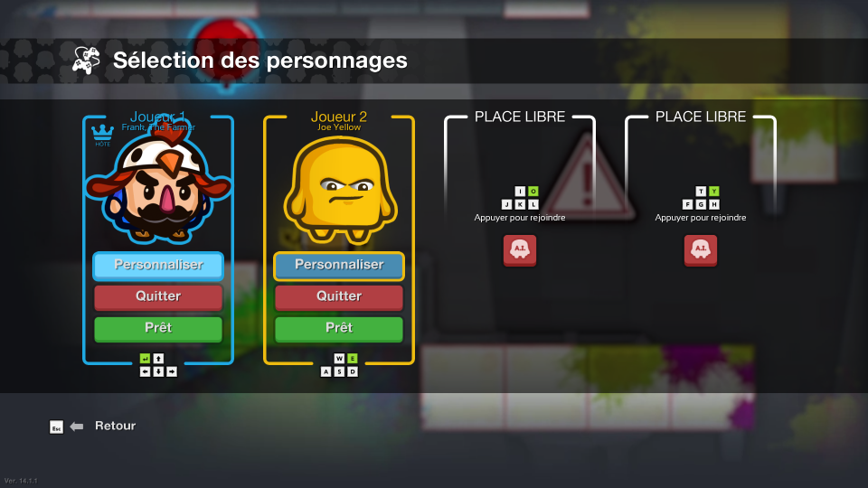

6) Select your stages. Either use a mouse, or leave it to the players to select them.

> :warning: **Warning!** Some of the maps are really difficult with the dancepads, namely, every map using a special action to do ("Pres ... to do ..."). We recommand _not_ to select them.

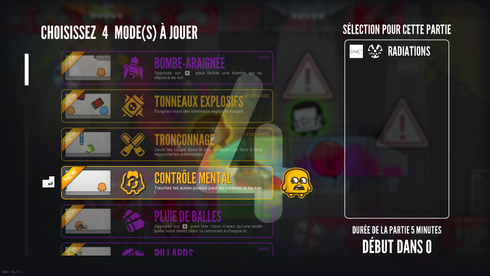

### Crypt of the Necromancer

Soon.
